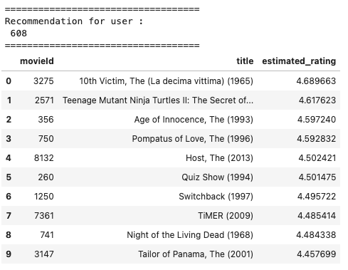

## Movie Recommendation System

**Manish Jaiswal**

### Executive summary

One of the critical problem in today's exploding e-commerce and streaming services landscape is around how to keep customer engaged on the respective platform. Engaging customer means, increased sales, customer loyalty, customer satisfaction and reducing churn.

Movie recommendation system, intends to solve such problem for a streaming service by enabling platform to provide movie recommendations for a user based on user's viewing and rating patterns and similarity with other users patterns.

### Rationale
**Why should anyone care about this question?**

As described above, a good recommendation system / model can play crucial role in business growth. We can apply recommendation models in varying areas like e-commerce, retail, media, banking , utilities etc.

With such models in place, we can personalize customer's experiences and enable better customer engagement.

### Research Question
**What are you trying to answer?**

Using the recommendation models learnt during the course, I plan to answer following questions
1. Given a user, what are the top 10 movie recommendations
2. Given a user, what are the top 3 Genre recommendations
3. Given a user, what are the top 5 users similar to the user.
4. Given a movie, what are the top 5 movies similar to it.
5. How do the different model compare against each other w.r.t training time, accuracy, precision, recall
6. Identify best parameters for each model being tested.

### Data Sources
**What data will you use to answer you question?**
I will be using MovieLens dataset below
https://files.grouplens.org/datasets/movielens/ml-100k.zip

#### Data Insights

Below we see some visualization built on top of the data.

1. Rating count distribution
  

WE can see that number of ratings received for most movies is within 50 counts, with few movies receiving more than 50 ratings

2. Mean rating distribution
  

Here we notice most of the movie ratings fall between 2.5 to 4.5.

3. Top 10 most rated movies

  

4. Top 10 most active users giving ratings

  

### Methodology
**What methods are you using to answer the question?**

For questions related to similarity, we will utilize 
**distance based recommendations**. In this case we create similarity matrices for movie ratings by different users and for users giving ratings to different movies. We use these matrices to get similar movies for a given movie or similar users for a given user.
  

  

Then we will utilize following models exposed by Surprise package. We can see movie recommendations for a particular user (user id = 608) and estimated rating expected from the user for the movie, as per each model below.
1. KNNBasic - Using basic nearest neighbors approach.
  

2. SVD - Singular Value Decomposition (SVD), a classical method from linear algebra.
  

3. CoClustering - A collaborative filtering algorithm based on co-clustering.
  

### Results
What did your research find?

Below is the performance comparison on different models executed

|model       |Default Fit Time  |Default RMSE      |CrossCV Fit Time  |CrossCV RMSE      |GridSearchCV Fit Time|GridSearchCV RMSE |GridSearchCV Best Params                                         |
|------------|------------------|------------------|------------------|------------------|---------------------|------------------|-----------------------------------------------------------------|
|KNNBasic    |0.0936870574951171|0.7262389271085168|0.0667179584503173|0.9486213930748983|79.09223484992981    |0.9523379700007936|{'k': 20, 'sim_options': {'name': 'msd', 'user_based': True}}    |
|SVD         |6.504531145095825 |0.6394634024675867|5.438243961334228 |0.8733599066924167|217.91046714782715   |0.869583820921453 |{'n_factors': 2, 'n_epochs': 20, 'lr_all': 0.01, 'reg_all': 0.04}|
|CoClustering|1.3927361965179443|0.8262597187954481|1.3768799304962158|0.9453072881814469|291.35339307785034   |0.9535741835394321|{'n_epochs': 200, 'n_cltr_u': 3}                                 |

We can observe from the table able that SVD had the least root squared errors when compared to other models when run with best params per grid search and default run. However, the time to fit the model was on higher side.

### Outline of project

- [Distance Based Similarity User n Movies](https://github.com/manish237/AIMLCapstone/blob/main/Capstone-DistanceBased.ipynb)
- [Movie Recommendation using KNNBasic](https://github.com/manish237/AIMLCapstone/blob/main/Capstone-KNN.ipynb)
- [Movie Recommendation using SVD](https://github.com/manish237/AIMLCapstone/blob/main/Capstone-SVD.ipynb)
- [Movie Recommendation using CoClustering](https://github.com/manish237/AIMLCapstone/blob/main/Capstone-coclustering.ipynb)

### Contact and Further Information
Email: manish23@gmail.com